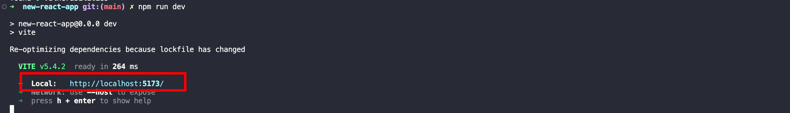

## 3: Triển khai luồng giao diện người dùng cho tính năng Ghi chú
Trong bước này, 
bạn sẽ cập nhật tệp `src/App.jsx` để cấu hình thư viện Amplify với tệp cấu hình client (amplify_outputs.json).
 Sau đó, nó sẽ tạo một client dữ liệu sử dụng hàm `generateClient()`.

Mã này sử dụng thành phần `Amplify Authenticator` để tạo ra toàn bộ luồng xác thực người dùng,
 cho phép người dùng đăng ký, đăng nhập, đặt lại mật khẩu và 
 xác nhận đăng nhập cho xác thực đa yếu tố (MFA).

Ngoài ra, mã này còn chứa các chức năng sau:
- `fetchNotes` - Sử dụng client dữ liệu để liệt kê các mục trong mô hình Notes.
- `createNote` - Lấy dữ liệu từ biểu mẫu và sử dụng client dữ liệu để tạo một ghi chú mới nếu người dùng chọn một hình ảnh. Sau đó, hàm sẽ tải hình ảnh này lên lưu trữ Amplify và liên kết nó với ghi chú mới.
- `deleteNote` - Sử dụng client dữ liệu để xóa ghi chú đã chọn.

1. Trên máy cục bộ của bạn, điều hướng đến tệp `new-react-app/src/App.jsx`, và cập nhật nó với mã sau.
```typescript copy
import { useState, useEffect } from "react";
import {
  Authenticator,
  Button,
  Text,
  TextField,
  Heading,
  Flex,
  View,
  Image,
  Grid,
  Divider,
} from "@aws-amplify/ui-react";
import { Amplify } from "aws-amplify";
import "@aws-amplify/ui-react/styles.css";
import { getUrl } from "aws-amplify/storage";
import { uploadData } from "aws-amplify/storage";
import { generateClient } from "aws-amplify/data";
import outputs from "../amplify_outputs.json";
/**
 * @type {import('aws-amplify/data').Client<import('../amplify/data/resource').Schema>}
 */

Amplify.configure(outputs);
const client = generateClient({
  authMode: "userPool",
});

export default function App() {
  const [notes, setNotes] = useState([]);

  useEffect(() => {
    fetchNotes();
  }, []);

  async function fetchNotes() {
    const { data: notes } = await client.models.Note.list();
    await Promise.all(
      notes.map(async (note) => {
        if (note.image) {
          const linkToStorageFile = await getUrl({
            path: ({ identityId }) => `media/${identityId}/${note.image}`,
          });
          console.log(linkToStorageFile.url);
          note.image = linkToStorageFile.url;
        }
        return note;
      })
    );
    console.log(notes);
    setNotes(notes);
  }

  async function createNote(event) {
    event.preventDefault();
    const form = new FormData(event.target);
    console.log(form.get("image").name);

    const { data: newNote } = await client.models.Note.create({
      name: form.get("name"),
      description: form.get("description"),
      image: form.get("image").name,
    });

    console.log(newNote);
    if (newNote.image)
      if (newNote.image)
        await uploadData({
          path: ({ identityId }) => `media/${identityId}/${newNote.image}`,

          data: form.get("image"),
        }).result;

    fetchNotes();
    event.target.reset();
  }

  async function deleteNote({ id }) {
    const toBeDeletedNote = {
      id: id,
    };

    const { data: deletedNote } = await client.models.Note.delete(
      toBeDeletedNote
    );
    console.log(deletedNote);

    fetchNotes();
  }

  return (
    <Authenticator>
      {({ signOut }) => (
        <Flex
          className="App"
          justifyContent="center"
          alignItems="center"
          direction="column"
          width="70%"
          margin="0 auto"
        >
          <Heading level={1}>My Notes App</Heading>
          <View as="form" margin="3rem 0" onSubmit={createNote}>
            <Flex
              direction="column"
              justifyContent="center"
              gap="2rem"
              padding="2rem"
            >
              <TextField
                name="name"
                placeholder="Note Name"
                label="Note Name"
                labelHidden
                variation="quiet"
                required
              />
              <TextField
                name="description"
                placeholder="Note Description"
                label="Note Description"
                labelHidden
                variation="quiet"
                required
              />
              <View
                name="image"
                as="input"
                type="file"
                alignSelf={"end"}
                accept="image/png, image/jpeg"
              />

              <Button type="submit" variation="primary">
                Create Note
              </Button>
            </Flex>
          </View>
          <Divider />
          <Heading level={2}>Current Notes</Heading>
          <Grid
            margin="3rem 0"
            autoFlow="column"
            justifyContent="center"
            gap="2rem"
            alignContent="center"
          >
            {notes.map((note) => (
              <Flex
                key={note.id || note.name}
                direction="column"
                justifyContent="center"
                alignItems="center"
                gap="2rem"
                border="1px solid #ccc"
                padding="2rem"
                borderRadius="5%"
                className="box"
              >
                <View>
                  <Heading level="3">{note.name}</Heading>
                </View>
                <Text fontStyle="italic">{note.description}</Text>
                {note.image && (
                  <Image
                    src={note.image}
                    alt={`visual aid for ${notes.name}`}
                    style={{ width: 400 }}
                  />
                )}
                <Button
                  variation="destructive"
                  onClick={() => deleteNote(note)}
                >
                  Delete note
                </Button>
              </Flex>
            ))}
          </Grid>
          <Button onClick={signOut}>Sign Out</Button>
        </Flex>
      )}
    </Authenticator>
  );
}
```

2. Mở một cửa sổ terminal mới, điều hướng đến thư mục gốc của ứng dụng của bạn (`new-react-app`), và chạy lệnh sau để khởi động ứng dụng:
```bash copy
npm run dev
```

3. Chọn liên kết Local host để mở ứng dụng.


4. Chọn tab `Create Account`, và sử dụng luồng xác thực để tạo một người dùng mới bằng cách nhập địa chỉ email và mật khẩu của bạn. Sau đó, chọn `Create Account`.


5. Bạn sẽ nhận được một mã xác minh được gửi đến email của bạn. Nhập mã xác minh để đăng nhập vào ứng dụng. Khi đã đăng nhập, bạn có thể bắt đầu tạo ghi chú và xóa chúng.

6. Mở một cửa sổ terminal mới, điều hướng đến thư mục gốc của ứng dụng của bạn (`new-react-app`), và chạy lệnh sau để đẩy các thay đổi lên GitHub:
```bash copy
git add .
git commit -m "Implement Notes feature with Amplify"
git push origin main
```

7. Đăng nhập vào bảng điều khiển AWS Management trong một cửa sổ trình duyệt mới, và mở bảng điều khiển AWS Amplify tại [https://console.aws.amazon.com/amplify/apps](https://console.aws.amazon.com/amplify/apps).

8. AWS Amplify tự động xây dựng mã nguồn của bạn và triển khai ứng dụng của bạn tại https://...amplifyapp.com, và mỗi lần bạn đẩy mã lên git, phiên bản triển khai của bạn sẽ được cập nhật. Chọn nút `Visit deployed URL` để xem ứng dụng web của bạn đang chạy trực tiếp.