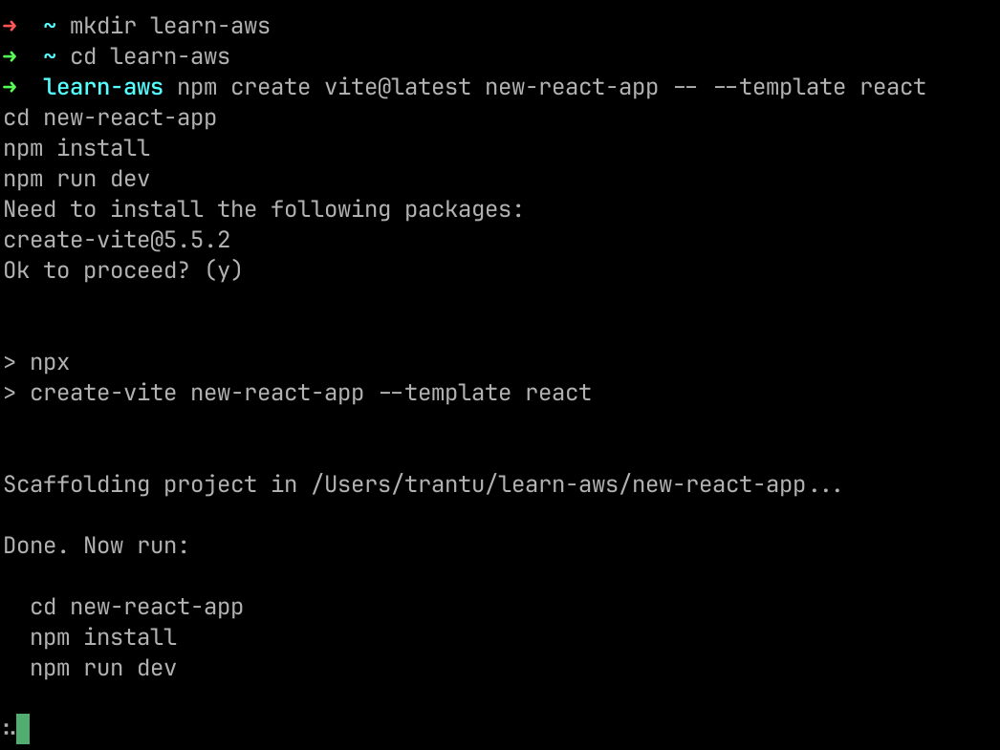
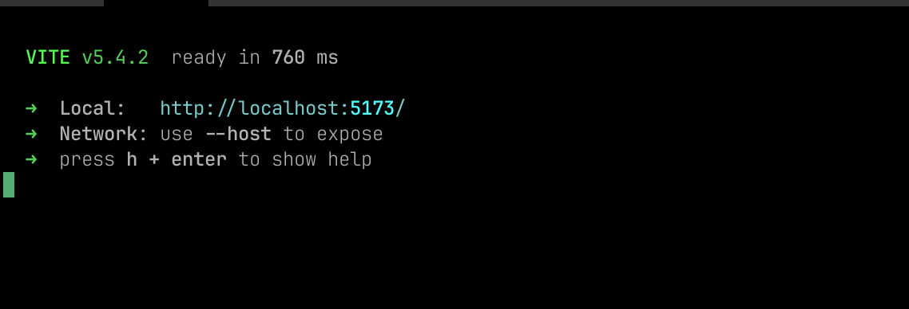

## 1: Tạo một ứng dụng React mới
1. Mở terminal và chạy lệnh sau để tạo một ứng dụng React mới với tên là `new-react-app`:
```bash copy
npm create vite@latest new-react-app -- --template react
cd new-react-app
npm install
npm run dev
```



2. Mở trình duyệt và truy cập vào [http://localhost:5173](http://localhost:5173) để xem ứng dụng của bạn.

