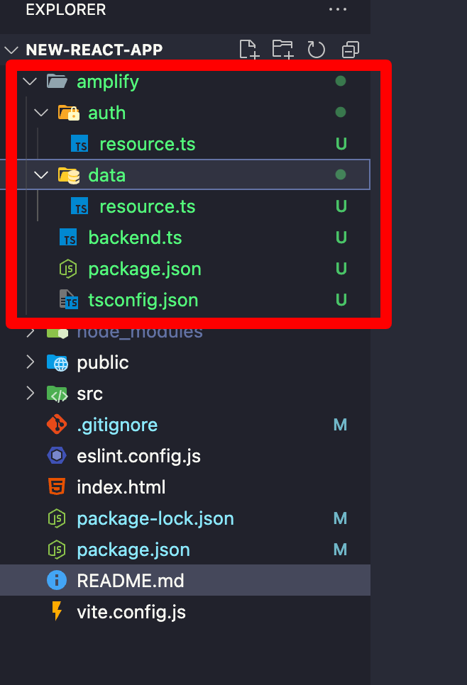

## 3: Cài đặt các gói Amplify
1. Mở một cửa sổ terminal mới, điều hướng đến thư mục gốc của ứng dụng của bạn (new-react-app), và chạy lệnh sau:
```bash copy
npm create amplify@latest -y
```

2. Sau khi cài đặt xong, sẽ tạo ra 1 thư mục như thế này:


3. Đẩy code lên kho lưu trữ GitHub:
```bash copy
git add .
git commit -m "add amplify"
git push origin main
```