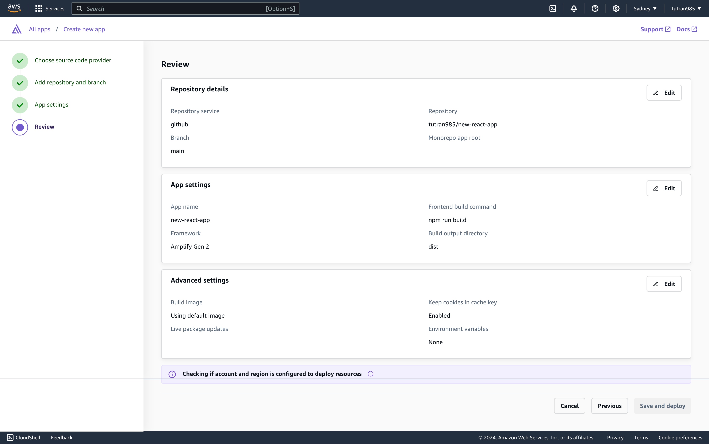

## 4: Triển khai ứng dụng của bạn với AWS Amplify
Trong bước này, bạn sẽ kết nối kho lưu trữ GitHub mà bạn vừa tạo với AWS Amplify. Điều này sẽ cho phép bạn xây dựng và triển khai ứng dụng của mình trên AWS.
1. Đăng nhập vào bảng điều khiển AWS Management trong một cửa sổ trình duyệt mới,
 và mở bảng điều khiển AWS Amplify tại https://console.aws.amazon.com/amplify/apps.
 

2. Chọn `Create new app.`

3. Chọn `GitHub` trong phần `Deploy your app` và nhấn `Next`.

4. Kết nối GitHub với AWS Amplify

5. Chọn kho lưu trữ GitHub mà bạn vừa tạo và nhấn `Next`.

6. Để nguyên cài đặt mặc định và nhấn `Next`.

7. Nhấn `Save and deploy` để triển khai ứng dụng của bạn.

AWS Amplify sẽ bắt đầu xây dựng mã nguồn của bạn và 
triển khai ứng dụng của bạn tại https://...amplifyapp.com, 
và mỗi lần bạn đẩy mã lên git, phiên bản triển khai của bạn sẽ được cập nhật.
Có thể mất đến 5 phút để triển khai ứng dụng của bạn.

8. Khi triển khai hoàn tất, chọn nút `Visit deployed URL` để xem ứng dụng web của bạn đang chạy trực tiếp.
