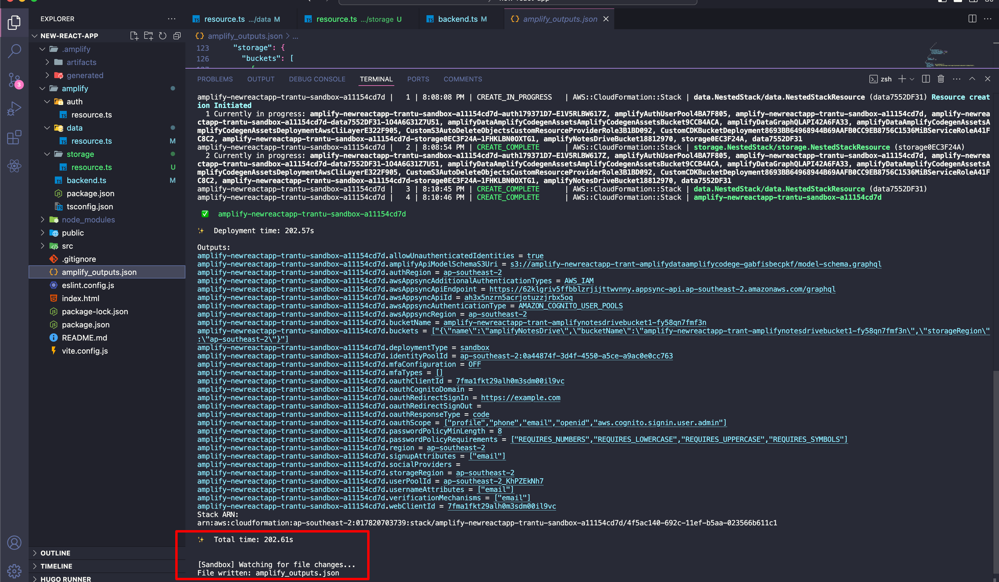

## 4: Triển khai Amplify Clound sandbox

1. Trên máy cục bộ của bạn, điều hướng đến tệp `amplify/backend.ts`, 
và cập nhật nó với mã sau. Sau đó, lưu tệp lại.
- Mã sau sẽ nhập các định nghĩa backend của auth, data, và storage:
```typescript copy
import { defineBackend } from '@aws-amplify/backend';
import { auth } from './auth/resource';
import { data } from './data/resource';
import { storage } from './storage/resource';

/**
 * @see https://docs.amplify.aws/react/build-a-backend/ to add storage, functions, and more
 */
defineBackend({
  auth,
  data,
  storage
});
```

2. Để bắt đầu môi trường sandbox đám mây cá nhân của riêng bạn, cung cấp một không gian phát triển riêng biệt, trong một cửa sổ terminal mới, chạy lệnh sau trong thư mục gốc của ứng dụng của bạn:

```bash copy
npx ampx sandbox
```

> **Ghi chú**: Môi trường sandbox cho phép bạn nhanh chóng xây dựng, kiểm thử và lặp lại trên một ứng dụng fullstack. Mỗi nhà phát triển trong nhóm của bạn có thể sử dụng môi trường sandbox riêng của họ, được kết nối với các tài nguyên đám mây. Bạn có thể tìm hiểu thêm về nó [tại đây](https://docs.amplify.aws/react/deploy-and-host/sandbox-environments/). 

3. Sau khi môi trường sandbox đám mây được triển khai hoàn tất, terminal của bạn sẽ hiển thị một thông báo xác nhận và tệp `amplify_outputs.json` sẽ được tạo và thêm vào dự án của bạn.
